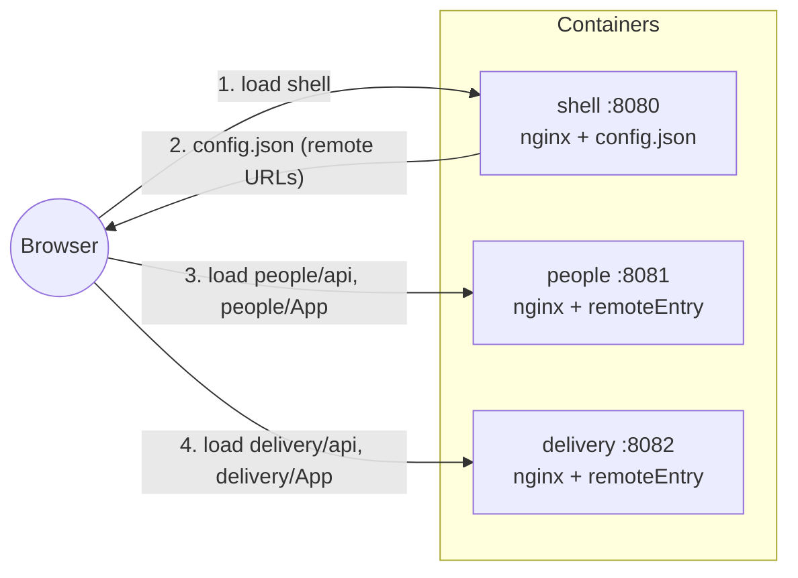
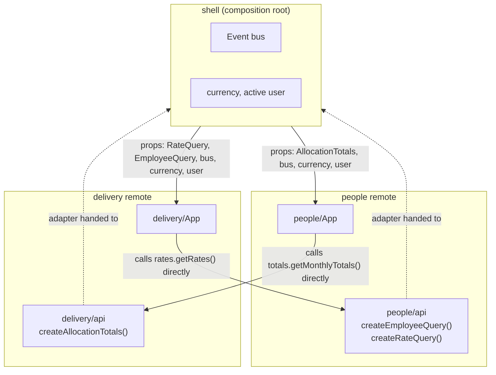
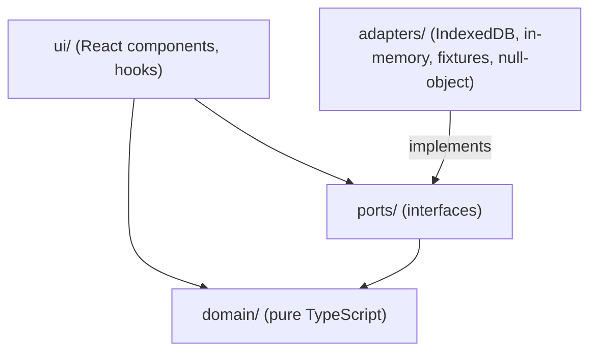
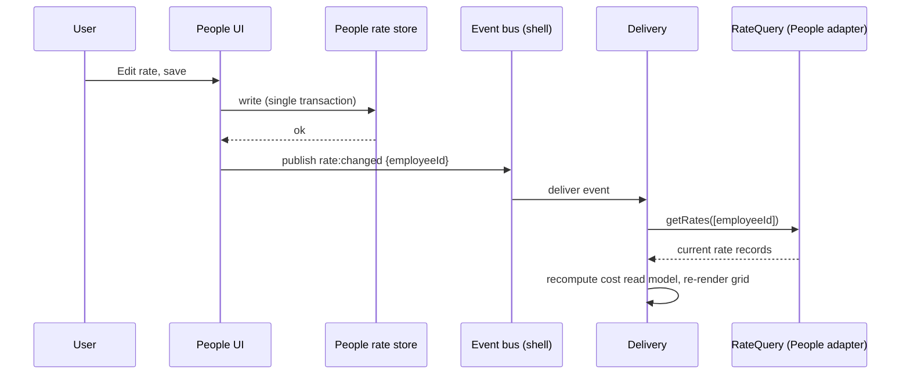
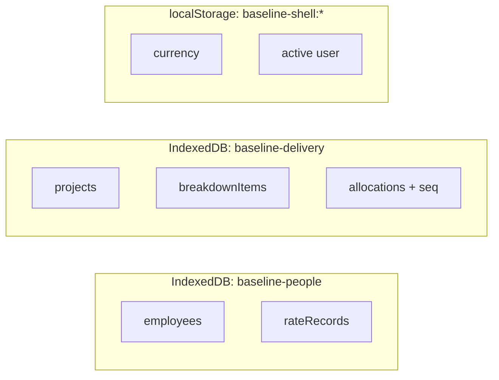
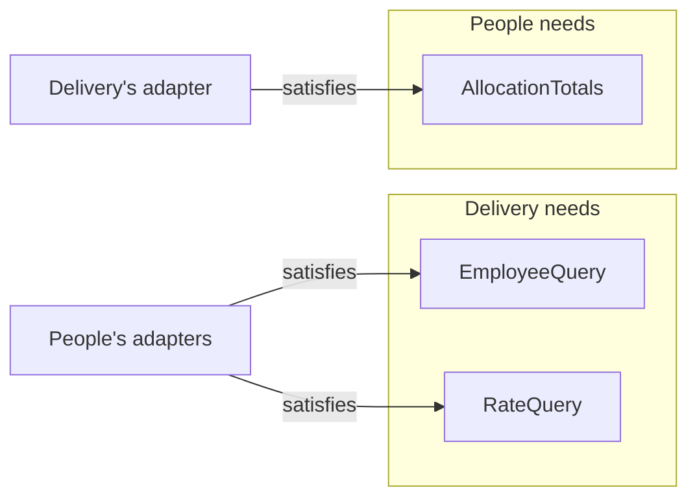

# Baseline Planning Suite

Baseline answers one question for a delivery organisation: **who is working on what, for how long, and what it costs.**

It is built as three independently built and deployed micro-frontends:

| App          | Owns                                                                                 | Port |
| ------------ | ------------------------------------------------------------------------------------ | ---- |
| **shell**    | Navigation, display currency, active user, composition of the other two              | 8080 |
| **people**   | Employee register, weekly hours, effective-dated cost-rate history                   | 8081 |
| **delivery** | Projects, work breakdown tree, month-by-month staffing grid, cost and capacity views | 8082 |

> **Status note:** run instructions and file paths below describe the intended layout. Verify each command against the repository as it stands and update this file if anything drifted.

---

## 1. Run it

Requirements: Docker with Compose. No Node on the host.

```bash
git clone git@github.com:andreiiuga/baseline-planning-suite.git
cd baseline-planning-suite
docker compose up --build
```

Open <http://localhost:8080>.

| URL                   | What                              |
| --------------------- | --------------------------------- |
| http://localhost:8080 | Shell (hosts People and Delivery) |
| http://localhost:8081 | People, standalone                |
| http://localhost:8082 | Delivery, standalone              |

### Break a remote on purpose

The shell must stay alive when a remote fails and say so in place of that panel.

```bash
# 1. Stop the container (remote is down)
docker compose stop people

# 2. Or point the shell at a URL that 404s (no rebuild, the shell container restarts)
PEOPLE_REMOTE_URL=http://localhost:8082/does-not-exist.js docker compose up -d shell

# 3. Or point it at a dead host
PEOPLE_REMOTE_URL=http://localhost:9999/remoteEntry.js docker compose up -d shell
```

Restore with `docker compose up -d` (plus `docker compose start people` after option 1). A refused connection fails immediately; a host that accepts but never answers hits the shell's 5 s load timeout, which is covered by a unit test (`apps/shell/tests/timeout.test.ts`).

Expected: the People panel shows "People is unavailable". Delivery still loads. Delivery's capacity and cost views degrade to "unavailable" for anything that needs People's data, instead of crashing.

### Configuration (container environment)

| Variable              | Container        | Default                                |
| --------------------- | ---------------- | -------------------------------------- |
| `PEOPLE_REMOTE_URL`   | shell            | `http://localhost:8081/remoteEntry.js` |
| `DELIVERY_REMOTE_URL` | shell            | `http://localhost:8082/remoteEntry.js` |
| `ALLOWED_ORIGIN`      | people, delivery | `http://localhost:8080`                |

Host ports can be overridden with `SHELL_PORT`, `PEOPLE_PORT` and `DELIVERY_PORT` (for example when 8081 is taken by another tool). If you move a remote, set its `*_REMOTE_URL` to match, because the browser resolves it.

The shell's entrypoint writes these into `/config.json` at container start. The URLs are never part of a bundle, so the same image can point anywhere.

### Develop and test (inside containers or with local pnpm)

```bash
pnpm install
pnpm test                # all unit tests (Vitest)
pnpm test:contracts      # People's real adapter against Delivery's contract suite
pnpm lint
pnpm typecheck
```

### Reset data

Each app persists to its own browser database and seeds from the fixture on first use. Every app has a "Reset demo data" action. Manual alternative: DevTools, Application, IndexedDB, delete `baseline-people` or `baseline-delivery`, reload.

---

## 2. Architecture overview

### 2.1 Topology



Remote URLs are resolved at runtime. The shell fetches `/config.json`, registers the remotes with the Module Federation runtime, and loads them on demand. React and ReactDOM are shared singletons, so one copy runs in the page.

### 2.2 The shell is a composition root, not middleware



The shell wires adapters to ports once, at mount. After that the two remotes talk to each other's adapters directly, and the shell is not in the data path. A shell that brokered every call would become a bottleneck and force a shell release for every contract change.

### 2.3 Layering inside each app



Dependencies point inward. `domain/` imports nothing from React, IndexedDB or the other app, so it is testable without a browser.

### 2.4 Live update: a rate edited in People reaches Delivery



The event carries only an ID. Delivery re-reads through the port, so it never acts on stale or out-of-order payloads.

### 2.5 Data ownership



One owner per piece of data. Nothing outside an app's `adapters/` folder opens its database.

### 2.6 Ports between the remotes



Each port is declared in the app that consumes it, and the provider only has to satisfy the shape.

---

## 3. Project structure

```text
baseline-planning-suite/
├── apps/
│   ├── shell/
│   │   ├── src/
│   │   │   ├── bootstrap.ts          # fetch config.json, init MF runtime
│   │   │   ├── compose.tsx           # composition root: build adapters, inject props
│   │   │   ├── RemotePanel.tsx       # ErrorBoundary + Suspense + timeout per remote
│   │   │   ├── bus/                  # event bus implementation
│   │   │   └── chrome/               # nav, currency picker, user picker
│   │   └── tests/resilience/         # broken remote shows fallback panel
│   ├── people/
│   │   ├── src/
│   │   │   ├── domain/               # rate history rules, validation (pure)
│   │   │   ├── ports/                # AllocationTotals, EventBus
│   │   │   ├── adapters/             # IndexedDB repositories, seed, null adapters
│   │   │   ├── exposed/api.ts        # createEmployeeQuery, createRateQuery
│   │   │   ├── ui/                   # register, rate history editor
│   │   │   ├── App.tsx               # exposed as people/App
│   │   │   └── standalone.tsx        # standalone entry, fixture adapters, local bus
│   │   └── tests/{unit,provider}/
│   └── delivery/
│       ├── src/
│       │   ├── domain/
│       │   │   ├── dates.ts          # date-only type, working days
│       │   │   ├── rates.ts          # slicing, coverage, blended rate
│       │   │   ├── units.ts          # PM / hours / % / EUR conversions
│       │   │   ├── rounding.ts       # scaled integers, largest remainder
│       │   │   ├── rollup.ts         # parent derivation, totals
│       │   │   ├── capacity.ts       # cross-project capacity, culprit selection
│       │   │   └── breakdown.ts      # create, rename, move, delete, leaf-to-parent move
│       │   ├── ports/                # RateQuery, EmployeeQuery, EventBus
│       │   ├── adapters/             # IndexedDB repositories, seed, fixture RateQuery
│       │   ├── exposed/api.ts        # createAllocationTotals
│       │   ├── ui/                   # tree, staffing grid, unit switcher
│       │   ├── App.tsx               # exposed as delivery/App
│       │   └── standalone.tsx
│       └── tests/
│           ├── unit/                 # golden reference calculation lives here
│           └── contracts/            # runRateQueryContract(factory)
├── integration/
│   └── contracts/                    # People's real adapter vs Delivery's contract suite
├── scripts/
│   └── make-seed-slices.ts           # splits baseline-seed.json into per-app slices
├── docker/
│   ├── Dockerfile                    # multi-stage, targets: shell | people | delivery
│   ├── nginx.shell.conf
│   ├── nginx.remote.conf
│   └── entrypoint-shell.sh           # writes config.json from env
├── docs/
│   ├── brief.pdf
│   └── baseline-seed.json
├── docker-compose.yml
├── tsconfig.base.json
├── eslint.config.js
├── pnpm-workspace.yaml
├── CLAUDE.md
└── README.md
```

---

## 4. Decisions and why

### 4.1 Canonical unit: person-months

`Allocation.amount` is stored in person-months.

- The fixtures already use it, so seeding loses nothing.
- Capacity (R5) becomes a plain sum compared with 1.0.
- % of capacity is PM x 100.
- Unit switching is lossless because the stored value never changes; hours and EUR are derived at the edges.

One person-month is `weeklyHours x (working days in month / 5)`, so it varies per person and month. Hours therefore need the employee and the month, which is why conversion lives in a dedicated `units.ts` module.

**Alternative considered:** hours. Physical and calendar-independent, but needs conversion on load and a floating-point round trip for every PM display.

### 4.2 Bundler: Vite with Module Federation

Vite with `@module-federation/vite`, registering remotes at runtime through `@module-federation/runtime`.

- Fast feedback loop and a current toolchain.
- Federation behaves differently in dev and in production builds, so everything is verified against the production images that Docker serves.
- Needs `build.target: 'esnext'` (top-level await), a correct `base` per remote, and `react` and `react-dom` declared as singletons.

**Fallback:** Rspack with `@module-federation/enhanced` if the Vite plugin becomes a blocker. App code would barely change.

### 4.3 Repository: pnpm monorepo, no shared contracts package

One repository with pnpm workspaces, so reviewers clone once. Independence is enforced by module boundaries and tests, not by splitting the repository.

There is deliberately **no shared contracts package**. Types are erased at build time, so a shared package gives a false sense of safety across independently deployed bundles. It would also force lockstep releases.

Instead, **contracts are consumer-owned**:

- Delivery declares `RateQuery` and `EmployeeQuery` in its own `ports/`.
- People declares `AllocationTotals` in its own `ports/`.
- Providers satisfy them through TypeScript's structural typing, with no import in either direction.
- A contract test suite, written once as a function over the port, runs against both the consumer's fixture adapter and the provider's real adapter.

**Trade-off:** small duplicated types, and the safety net only works if CI runs the contract tests. If the teams grow and want stronger compile-time guarantees, a provider-published types package is the next step.

### 4.4 Separate containers

Shell, People and Delivery are separate nginx containers, started by one `docker compose up`.

- Fault isolation: a dead or misdeployed remote does not take the others down.
- Independent deploys: `docker compose up -d --build people` touches one app only.
- A convincing failure demo: `docker compose stop people`.

**Costs:** CORS headers on the remotes (origin from `ALLOWED_ORIGIN`), absolute browser-resolvable URLs in `config.json` (never docker service names), and per-remote asset base paths. The shell and its `config.json` remain the single entry point and cannot be isolated.

### 4.5 Runtime remote configuration

The shell's entrypoint writes `/config.json` from environment variables at container start. The shell fetches it with `no-store`, validates its shape, and registers remotes from it. `remoteEntry.js` is served with `no-cache` so independent deployments are picked up immediately, and hashed chunks are cached long-term.

If `config.json` itself cannot load, the shell shows an explicit error screen instead of a blank page.

### 4.6 Persistence: IndexedDB through `idb`

- One database per app: `baseline-people`, `baseline-delivery`. The shell holds only currency and active user, in `localStorage` under `baseline-shell:`.
- IndexedDB gives transactions (moving a leaf's allocations, deleting a subtree) and indexes (`employeeId+month` for the cross-project capacity sum), which `localStorage` does not.
- Each app seeds only its own slice, in a single transaction, guarded by `meta.seedVersion`. Slices are generated from the provided seed by `scripts/make-seed-slices.ts` with IDs and values intact.
- No backend. The brief scores frontend architecture, and edits only need to survive a reload.

**Honest limit:** IndexedDB is scoped by the origin of the page, not the script. In hosted mode all three apps run on the shell's origin, so ownership is enforced by convention and a lint rule (`indexedDB.open` allowed only inside `adapters/`), not by the browser. Standalone remotes run on their own origins and therefore have separate data from hosted mode. Real storage isolation would need iframes, which is a different architecture.

### 4.7 Rates: Delivery reads raw rate records and prices cost itself

The decision the brief explicitly assesses.

Delivery asks People for raw `RateRecord`s and runs its own cost engine. Reasons:

- Editing a cell in EUR divides by the cell's blended rate (EUR 89.5455/h in the reference), which needs the day-by-day slice math inside Delivery anyway.
- The grid is synchronous and re-renders 720 cells on every edit or unit switch. Per-cell async calls to another app would be chatty and fragile.
- "Before the first rate costs zero and is marked" falls out of raw records naturally.
- People ends up with no calendar math at all.

**Cost:** Delivery embeds the rule that `validFrom` is inclusive and the last rate is open-ended. That rule is pinned down by the contract test.

### 4.8 Ports and the `Availability` result

Three small interfaces, each owned by its consumer (interface segregation):

```ts
type Availability<T> = { status: 'ok'; data: T } | { status: 'unavailable' };

interface EmployeeQuery {
  listEmployees(): Promise<Availability<Employee[]>>;
}
interface RateQuery {
  getRates(ids: string[]): Promise<Availability<Record<string, RateRecord[]>>>;
}
interface AllocationTotals {
  getMonthlyTotals(
    ids: string[],
  ): Promise<Availability<{ employeeId: string; month: string; allocatedPM: number }[]>>;
}
```

- Reads are batched. Delivery loads rates into an in-memory read model and renders from it synchronously.
- "Unavailable" is a value, not an exception, so the UI is forced to handle it. A null-object adapter returns it when the other remote failed to load.
- Plain functions and data cross the boundary, never class instances, to avoid hidden coupling.
- Each remote exposes a small `api` module (no UI) separately from its `App` module. The shell loads `api` modules eagerly to wire adapters, and `App` modules lazily.

### 4.9 Event bus

Two events, each defined by its publisher:

| Event                                      | Owner    | Subscriber behaviour                         |
| ------------------------------------------ | -------- | -------------------------------------------- |
| `rate:changed { employeeId }`              | People   | Delivery re-reads rates for that employee    |
| `allocation:changed { employeeId, month }` | Delivery | People re-reads that person's monthly totals |

Rules: events are notifications and not data transfer, handlers are idempotent, and `publish` isolates handler failures with try/catch so one broken subscriber cannot stop the others. "Give me the rate" is a port call. "A rate changed" is an event.

Currency and active user are **props**, not events, because the brief says the shell pushes them in and props give normal React re-rendering.

Visited panels stay mounted (hidden) so an "open" Delivery view still receives updates, and Delivery re-reads on mount as a safety net. `BroadcastChannel` for cross-tab sync is optional.

### 4.10 Capacity and overcapacity

- Capacity is 1.0 PM per person per month, summed across **all** projects directly from the store, including projects not currently open.
- Overcapacity is flagged when `total > 1 + 1e-9`. The epsilon avoids false flags from floating-point sums of decimals. Both apps apply the same threshold, kept consistent by a contract test.
- People shows the person as oversubscribed. Delivery names the culprit: the allocation with the highest `seq` among those contributing to that person-month.
- `seq` is a monotonic counter per allocation. Seeded rows take file order, and every amount edit bumps it. Moving an allocation does not bump it.
- The edit is flagged, never blocked.

Example in the seed: Milan Brandt (`emp-003`) has `alloc-050` and `alloc-073`, 0.59 PM each in June 2026, totalling 1.18.

### 4.11 Rounding and reconciliation

Totals are computed from exact values and rounded only for display. Displayed totals must equal the sum of displayed cells.

- Values are held as scaled integers (value x 10^dp): 2 dp for hours, PM and cost, 1 dp for %. Units are converted on exact values first, never on rounded ones.
- Leaf rows are authoritative: largest-remainder apportionment across months makes the row total equal the rounded exact sum.
- Parent rows and footers are sums of their displayed children, so every identity holds on screen by construction.
- Ties go to the earliest index so values do not flicker. A small epsilon is added before flooring, because `0.285 * 100` is `28.499999999999996`.

**Trade-off:** a parent total can differ from the nearest-rounded exact value by a few last-place units. In a 2D grid both axes cannot generally match the exact rounded values simultaneously, so visible reconciliation takes priority. Verified with property-based tests.

### 4.12 Rate validation

- `(employeeId, validFrom)` is unique, including when a correction moves a date onto an existing one.
- `hourlyCost` must be finite, greater than 0, with at most 2 decimals. `validFrom` must be a real calendar date.
- Rates can be added, corrected and removed anywhere in history, retroactively. Records are always sorted by `validFrom`, and each save publishes one `rate:changed`.
- Removing the first or only record is allowed. Affected cells then cost zero and are marked.
- Each cell carries `coverage: 'full' | 'partial' | 'none'`. If the first rate starts mid-month, the uncovered days cost zero and the cell is marked. In `none` cells the cost input is disabled (the blended rate is zero).
- Dates use a date-only type (`{ y, m, d }`) rather than `new Date('YYYY-MM-DD')` with local getters, which can shift a day depending on the time zone. Tests run under two zones.

### 4.13 Breakdown tree behaviour

- Parents are derived and read-only.
- **Adding a child under an allocated leaf moves all of the leaf's allocations onto the new child** in one transaction, with a message such as "Moved 14 allocations from X to Y". Totals before and after are equal, which is tested. Moved rows keep their `seq`.
- Tree depth is not capped at 3. Three levels describes the fixture, and capping would make the most likely test case (a level-3 leaf with allocations) impossible.
- Moving a node under an allocated leaf uses the same function. Moving a node under its own descendant is forbidden, and moves stay within one project.
- Delete asks for confirmation with the number of allocations and PM affected, runs in one transaction, and publishes `allocation:changed` for every affected person-month.

### 4.14 The March 2026 reference cell

`alloc-001` (A. Okafor, 0.5 PM, March 2026) is outside the default Apr 2026 to Mar 2027 window. It stays loaded and counts toward capacity. The grid takes a `months` list with previous/next controls that shift the 12-month window, so one step back brings March into view and the EUR 7,880.00 reference can be reproduced by hand. A golden unit test also covers it.

### 4.15 Currency and active user

- Costs are stored in EUR. The shell holds a small static FX table (EUR, USD, GBP) and passes `{ code, perEur }` as a prop, so remotes own no FX knowledge. The rates are illustrative, not live.
- Typing a cost in another currency divides by `perEur` first, then by the blended rate.
- People edits rates in EUR only, with converted values shown read-only, to avoid storing junk precision.
- The active user is a header dropdown with fixed names, passed down as a prop.

---

## 5. Domain reference

Working days are Monday to Friday. Public holidays are ignored.

| Concept               | Rule                                                                                     |
| --------------------- | ---------------------------------------------------------------------------------------- |
| Person-month          | `weeklyHours x (working days in month / 5)`                                              |
| Hours per working day | `allocation hours / working days in month`                                               |
| Month cost            | sum over rate slices of `working days in slice x hours per day x hourly cost`            |
| Rate validity         | from `validFrom` (inclusive) until the next record starts, the last record is open-ended |
| % of capacity         | PM x 100                                                                                 |
| Blended rate          | month cost / allocation hours                                                            |

### Golden reference

A. Okafor, 40 h/week, EUR 80/h from 2025-01-01 and EUR 95/h from 2026-03-12, one cell of 0.50 PM in March 2026:

| Quantity                        | Value                                                       |
| ------------------------------- | ----------------------------------------------------------- |
| Working days in March 2026      | 22                                                          |
| Before 12 March / from 12 March | 8 / 14                                                      |
| One person-month                | 40 x 22 / 5 = 176.00 h                                      |
| This allocation                 | 88.00 h (4.00 h per day)                                    |
| Cost                            | 8 x 4 x 80 + 14 x 4 x 95 = 2,560 + 5,320 = **EUR 7,880.00** |
| % of capacity                   | 50.0%                                                       |
| Blended rate                    | EUR 89.5455/h                                               |

---

## 6. Testing strategy

| Level       | Where                           | What                                                                                                                                                |
| ----------- | ------------------------------- | --------------------------------------------------------------------------------------------------------------------------------------------------- |
| Unit        | `apps/*/tests/unit`             | Pure domain logic with no React: working days, slicing, conversions, rounding, rollups, capacity, breakdown rules. The golden reference lives here. |
| Property    | `apps/delivery/tests/unit`      | `fast-check` on largest-remainder: sum identity, each cell within one unit of exact, parent identities.                                             |
| Contract    | `apps/delivery/tests/contracts` | `runRateQueryContract(factory)` asserts what Delivery relies on (sorted by `validFrom`, unknown employee gives an empty list, date format).         |
| Integration | `integration/contracts`         | Runs the same suite against People's real adapter. People's CI must run it before a release.                                                        |
| Resilience  | `apps/shell/tests/resilience`   | A broken or slow remote renders the fallback panel and the rest of the shell keeps working.                                                         |

Date logic is also run under `TZ=America/Los_Angeles` and `TZ=Pacific/Auckland`.

---

## 7. Known limitations and assumptions

- IndexedDB ownership between hosted remotes is convention plus lint, not browser-enforced (see 4.6).
- Hosted and standalone modes use separate datasets because they run on different origins.
- FX rates are static and illustrative.
- Seed allocations rank for "most recently edited" in file order.
- Moves in the breakdown tree stay within one project.
- Contract tests only protect against drift if CI runs them on both sides.
- The shell and `config.json` are the single entry point and cannot be isolated.

Not in scope, per the brief: visual polish, a design system, authentication, mobile, offline support and scheduling.
