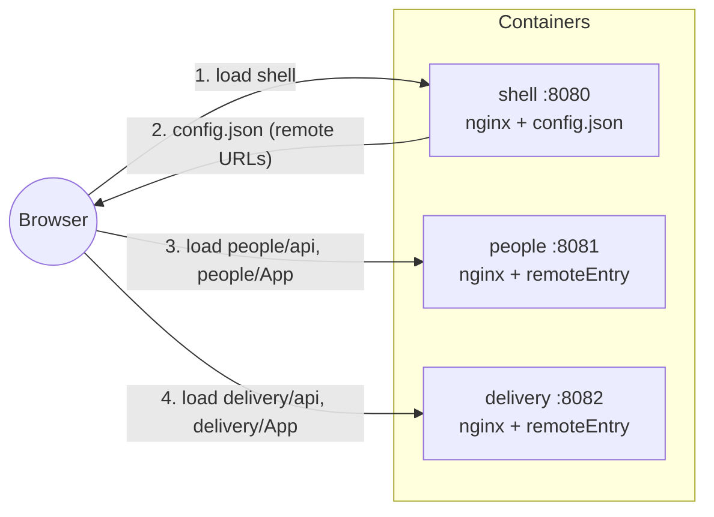
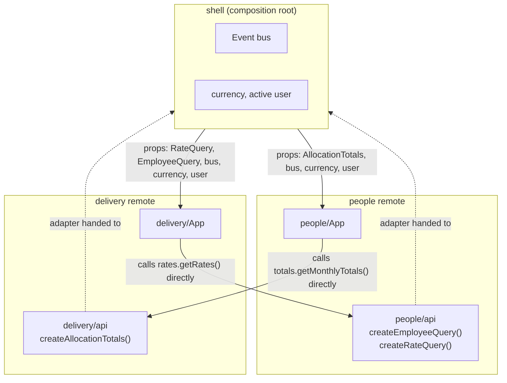
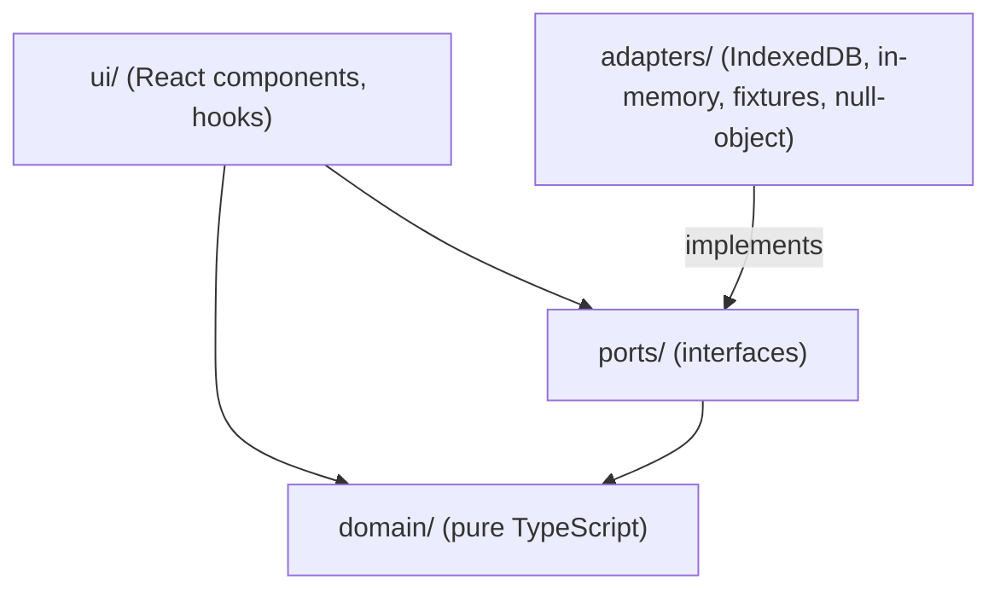
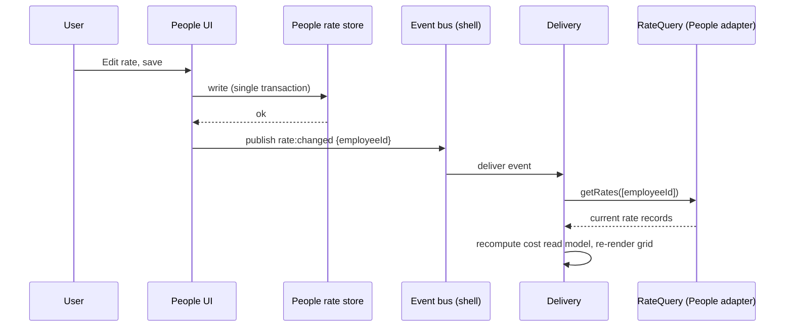
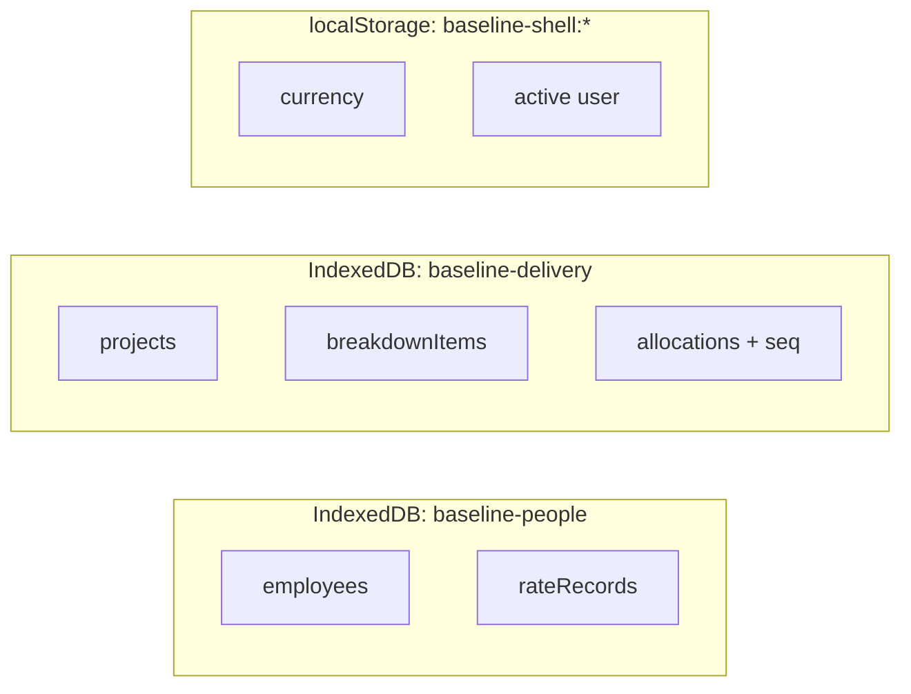
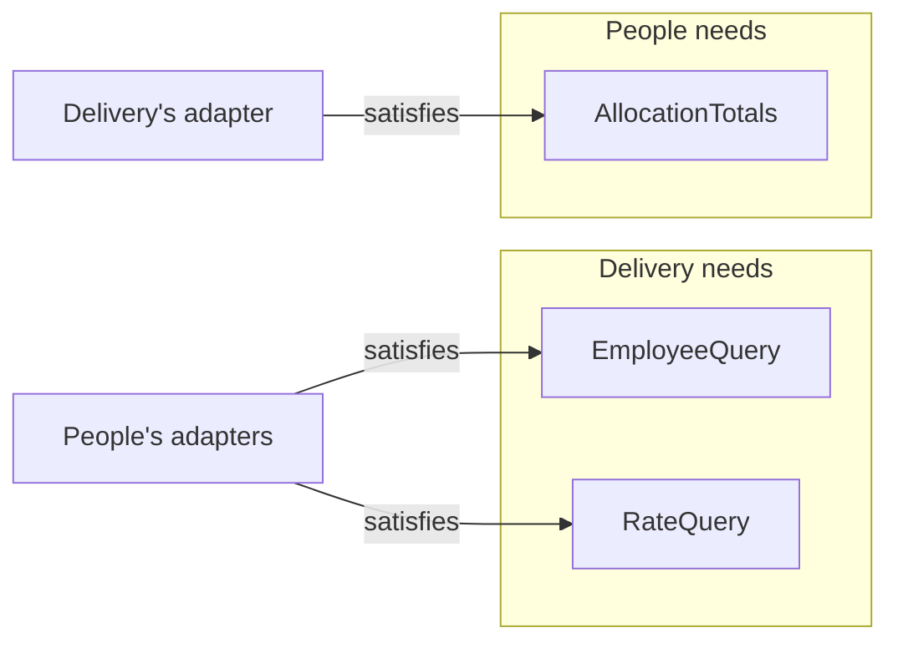

# Baseline Planning Suite

Baseline answers one question for a delivery organisation: **who is working on what, for how long, and what it costs.**

It is built as three independently built and deployed micro-frontends:

| App          | Owns                                                                                 | Port |
| ------------ | ------------------------------------------------------------------------------------ | ---- |
| **shell**    | Navigation, display currency, active user, composition of the other two              | 8080 |
| **people**   | Employee register, weekly hours, effective-dated cost-rate history                   | 8081 |
| **delivery** | Projects, work breakdown tree, month-by-month staffing grid, cost and capacity views | 8082 |

> Every command below was run from a fresh clone of this repository. The case study brief and fixtures are in `docs/`.

---

## 1. Run it

Requirements: Docker with Compose. No Node on the host.

```bash
git clone git@github.com:andreiiuga/baseline-planning-suite.git
cd baseline-planning-suite
docker compose up --build
```

Open <http://localhost:8080>.

| URL                                       | What                                                          |
| ----------------------------------------- | ------------------------------------------------------------- |
| http://localhost:8080                     | Shell (hosts People and Delivery); `/` redirects to `/people` |
| http://localhost:8080/people, `/delivery` | A section of the shell, linkable and reloadable               |
| http://localhost:8081                     | People, standalone                                            |
| http://localhost:8082                     | Delivery, standalone                                          |

### Break a remote on purpose

The shell must stay alive when a remote fails and say so in place of that panel.

```bash
# 1. Stop the container (remote is down)
docker compose stop people

# 2. Or point the shell at a URL that 404s (no rebuild, the shell container restarts)
PEOPLE_REMOTE_URL=http://localhost:8082/does-not-exist.js docker compose up -d shell

# 3. Or point it at a dead host
PEOPLE_REMOTE_URL=http://localhost:9999/remoteEntry.js docker compose up -d shell
```

Restore with `docker compose up -d` (plus `docker compose start people` after option 1). A refused connection fails immediately; a host that accepts but never answers hits the shell's 5 s load timeout, which is covered by a unit test (`apps/shell/tests/timeout.test.ts`).

Expected: the People panel shows "People is unavailable". Delivery still loads. Delivery's capacity and cost views degrade to "unavailable" for anything that needs People's data, instead of crashing.

### Configuration (container environment)

| Variable              | Container        | Default                                |
| --------------------- | ---------------- | -------------------------------------- |
| `PEOPLE_REMOTE_URL`   | shell            | `http://localhost:8081/remoteEntry.js` |
| `DELIVERY_REMOTE_URL` | shell            | `http://localhost:8082/remoteEntry.js` |
| `ALLOWED_ORIGIN`      | people, delivery | `http://localhost:8080`                |

Host ports can be overridden with `SHELL_PORT`, `PEOPLE_PORT` and `DELIVERY_PORT` (for example when 8081 is taken by another tool). If you move a remote, set its `*_REMOTE_URL` to match, because the browser resolves it.

The shell's entrypoint writes these into `/config.json` at container start. The URLs are never part of a bundle, so the same image can point anywhere.

### Develop and test

```bash
pnpm install             # Node 20.14 or newer on the host; the images and CI use Node 22
pnpm typecheck
pnpm lint
pnpm test                # unit, component and integration tests (Vitest)
pnpm test:tz             # the same suite under America/Los_Angeles and Pacific/Auckland
pnpm test:contracts      # each consumer's contract suite, run against both sides' real adapters
pnpm seed:slices         # regenerate the per-app seed slices from docs/baseline-seed.json
docker compose up --build -d && pnpm e2e    # Playwright against the running stack, using the installed Chrome
```

Tool versions are pinned to what runs on Node 20.14 (ESLint 9, Vitest 3, jsdom 26, TypeScript 5.9). Property tests use a random seed locally and a fixed one when `CI` is set.

### Reset data

Each app persists to its own browser database and seeds from its fixture slice on first use. People and Delivery each have a **Reset demo data** button (with a confirmation) that restores their own data and tells the other app to re-read. Manual alternative: DevTools, Application, IndexedDB, delete `baseline-people` or `baseline-delivery`, reload.

---

## 2. Architecture overview

### 2.1 Topology



Remote URLs are resolved at runtime. The shell fetches `/config.json`, registers the remotes with the Module Federation runtime, and loads them on demand. React and ReactDOM are shared singletons, so one copy runs in the page.

### 2.2 The shell is a composition root, not middleware



The shell wires adapters to ports once, at mount. After that the two remotes talk to each other's adapters directly, and the shell is not in the data path. A shell that brokered every call would become a bottleneck and force a shell release for every contract change.

### 2.3 Layering inside each app



Dependencies point inward. `domain/` imports nothing from React, IndexedDB or the other app, so it is testable without a browser.

### 2.4 Live update: a rate edited in People reaches Delivery



The event carries only an ID. Delivery re-reads through the port, so it never acts on stale or out-of-order payloads.

### 2.5 Data ownership



One owner per piece of data. Nothing outside an app's `adapters/` folder opens its database.

### 2.6 Ports between the remotes



Each port is declared in the app that consumes it, and the provider only has to satisfy the shape.

---

## 3. Project structure

```text
baseline-planning-suite/
├── apps/
│   ├── shell/                        # host: navigation, currency, active user, composition
│   │   ├── src/
│   │   │   ├── main.ts               # dynamic import, so shared modules initialise first
│   │   │   ├── bootstrap.tsx         # fetch config.json, register remotes, load apis, render
│   │   │   ├── config.ts             # config.json validation
│   │   │   ├── loadApis.ts           # load each remote's api module independently, with a timeout
│   │   │   ├── compose.ts            # composition root: turn loaded apis into ports
│   │   │   ├── contracts.ts          # the shell's opaque view of ports and App props
│   │   │   ├── Shell.tsx             # header, links, panels kept mounted once visited
│   │   │   ├── navigation.ts         # section paths, path to section, click handling (pure)
│   │   │   ├── useRoute.ts           # the active section kept in step with the URL (History API)
│   │   │   ├── SectionLink.tsx       # a real link the shell upgrades to in-page navigation
│   │   │   ├── RemotePanel.tsx       # ErrorBoundary + Suspense + timeout + Retry per remote
│   │   │   ├── bus/eventBus.ts       # typed event bus with isolated handlers
│   │   │   └── chrome/               # the shell's own UI chrome (the frame around the content, not the browser): currency table, user list, localStorage preferences
│   │   └── tests/
│   ├── people/                       # employee register and rate history
│   │   ├── src/
│   │   │   ├── domain/               # rate history rules, validation, search, capacity (pure)
│   │   │   ├── ports/                # PeopleRepository, AllocationTotals, event types
│   │   │   ├── adapters/             # IndexedDB and in-memory repositories, fixture and null adapters, seed
│   │   │   ├── exposed/              # api.ts (people/api): employee and rate queries other apps use
│   │   │   ├── ui/                   # register, rate history editor, oversubscription hook
│   │   │   ├── App.tsx               # exposed as people/App: opens storage, renders the UI
│   │   │   └── standalone.tsx        # standalone entry: fixture adapters, silent bus
│   │   └── tests/{unit,contracts,ui}/
│   └── delivery/                     # breakdown tree and staffing grid
│       ├── src/
│       │   ├── domain/
│       │   │   ├── dates.ts          # date-only types, weekday arithmetic, working days
│       │   │   ├── rates.ts          # slicing a month by rate, coverage
│       │   │   ├── units.ts          # person-months / hours / % / cost conversions, blended rate
│       │   │   ├── rounding.ts       # scaled integers, largest-remainder apportionment
│       │   │   ├── display.ts        # per-unit precision, month labels
│       │   │   ├── rollup.ts         # parent derivation, row, column and grand totals
│       │   │   ├── capacity.ts       # cross-project capacity, contributors, culprit, excess
│       │   │   ├── breakdown.ts      # create, rename, move, delete, allocation moves
│       │   │   ├── staffing.ts       # the grid in a unit and currency, naming helpers
│       │   │   └── amountInput.ts    # parsing typed amounts
│       │   ├── ports/                # PlanRepository, RateQuery, EmployeeQuery, event types
│       │   ├── adapters/             # IndexedDB and in-memory repositories, fixture and null adapters, seed
│       │   ├── exposed/              # api.ts (delivery/api): allocation totals other apps use
│       │   ├── ui/                   # tree, staffing grid and cell, over-capacity view, amount input, data hooks
│       │   ├── App.tsx               # exposed as delivery/App
│       │   └── standalone.tsx
│       └── tests/
│           ├── unit/                 # the golden reference is golden-reference.test.ts
│           ├── contracts/            # RateQuery and EmployeeQuery contract suites (Delivery owns them)
│           └── ui/
├── integration/
│   ├── contracts/                    # each real adapter against the other app's contract suite
│   ├── events/                       # the shell bus satisfies both apps' bus ports
│   └── seed/                         # slice generation and drift
├── e2e/                              # Playwright against the running stack
├── scripts/                          # seed slicer and its invariant checks
├── docker/                           # Dockerfile (targets shell | people | delivery), nginx configs, entrypoint
├── docs/                             # brief.pdf, baseline-seed.json
├── .github/workflows/ci.yml
├── docker-compose.yml
├── PLAN.md                           # the staged build plan this history follows
├── CLAUDE.md                         # project context and decisions
└── README.md
```

---

## 4. Decisions and why

### 4.1 Canonical unit: person-months

`Allocation.amount` is stored in person-months.

- The fixtures already use it, so seeding loses nothing.
- Capacity (R5) becomes a plain sum compared with 1.0.
- % of capacity is PM x 100.
- Unit switching is lossless because the stored value never changes; hours and EUR are derived at the edges.

One person-month is `weeklyHours x (working days in month / 5)`, so it varies per person and month. Hours therefore need the employee and the month, which is why conversion lives in a dedicated `units.ts` module.

**Alternative considered:** hours. Physical and calendar-independent, but needs conversion on load and a floating-point round trip for every PM display.

### 4.2 Bundler: Vite with Module Federation

Vite with `@module-federation/vite`, registering remotes at runtime through `@module-federation/runtime`.

- Fast feedback loop and a current toolchain.
- Federation behaves differently in dev and in production builds, so everything is verified against the production images that Docker serves.
- Needs `build.target: 'esnext'` (top-level await), a relative `base` per remote (`./`, so chunks resolve against the remote's own origin and not the host page's), and `react` and `react-dom` declared as singletons.
- Vite emits an ES-module remote entry, so remotes are registered at runtime with `type: 'module'`. Without it the runtime loads the entry as a classic script and fails with "Cannot use import statement outside a module".
- Type generation (`dts`) is switched off: it fetches over the network at build time, and the shell declares its own view of what it loads (`remotes.d.ts`).
- Verified in the production images: React loads once, from the shell's origin; a hosted remote requests none of its own copy.

**Fallback:** Rspack with `@module-federation/enhanced` if the Vite plugin becomes a blocker. App code would barely change. It was not needed.

### 4.3 Repository: pnpm monorepo, no shared contracts package

One repository with pnpm workspaces, so reviewers clone once. Independence is enforced by module boundaries and tests, not by splitting the repository.

There is deliberately **no shared contracts package**. Types are erased at build time, so a shared package gives a false sense of safety across independently deployed bundles. It would also force lockstep releases.

Instead, **contracts are consumer-owned**:

- Delivery declares `RateQuery` and `EmployeeQuery` in its own `ports/`.
- People declares `AllocationTotals` in its own `ports/`.
- Providers satisfy them through TypeScript's structural typing, with no import in either direction.
- A contract test suite, written once as a function over the port, runs against both the consumer's fixture adapter and the provider's real adapter. `integration/` imports from both apps to do that: it is test code, the only place the two sit side by side, and nothing shipped imports across.
- The shell sits between them and treats every payload as `unknown` (`contracts.ts`): it forwards ports, it never reads them. The compiler therefore cannot check the shell's props against a remote's. The contract suites are what check that, which is the point of having them.

**Trade-off:** small duplicated types, and the safety net only works if CI runs the contract tests. If the teams grow and want stronger compile-time guarantees, a provider-published types package is the next step.

### 4.4 Separate containers

Shell, People and Delivery are separate nginx containers, started by one `docker compose up`.

- Fault isolation: a dead or misdeployed remote does not take the others down.
- Independent deploys: `docker compose up -d --build people` touches one app only.
- A convincing failure demo: `docker compose stop people`.

**Costs:** CORS headers on the remotes (origin from `ALLOWED_ORIGIN`, which must match the shell's origin if you change `SHELL_PORT`), absolute browser-resolvable URLs in `config.json` (never docker service names), and per-remote asset base paths. The shell and its `config.json` remain the single entry point and cannot be isolated.

### 4.5 Runtime remote configuration

The shell's entrypoint writes `/config.json` from environment variables at container start. The shell fetches it with `no-store`, validates its shape, and registers remotes from it. `remoteEntry.js` is served with `no-cache` so independent deployments are picked up immediately, and hashed chunks are cached long-term.

If `config.json` itself cannot load, the shell shows an explicit error screen instead of a blank page.

### 4.6 Persistence: IndexedDB through `idb`

- One database per app: `baseline-people`, `baseline-delivery`. The shell holds only currency and active user, in `localStorage` under `baseline-shell:`.
- IndexedDB gives transactions (moving a leaf's allocations, deleting a subtree) and indexes (`employeeId+month` for the cross-project capacity sum), which `localStorage` does not.
- Each app seeds only its own slice, in a single transaction, guarded by `meta.seedVersion`. Slices are generated from the provided seed by `scripts/make-seed-slices.ts` with IDs and values intact.
- No backend. The brief scores frontend architecture, and edits only need to survive a reload.

**Honest limit:** IndexedDB is scoped by the origin of the page, not the script. In hosted mode all three apps run on the shell's origin, so ownership is enforced by convention and a lint rule (`indexedDB.open` allowed only inside `adapters/`), not by the browser. Standalone remotes run on their own origins and therefore have separate data from hosted mode. Real storage isolation would need iframes, which is a different architecture.

### 4.7 Rates: Delivery reads raw rate records and prices cost itself

The decision the brief explicitly assesses.

Delivery asks People for raw `RateRecord`s and runs its own cost engine. Reasons:

- Editing a cell in EUR divides by the cell's blended rate (EUR 89.5455/h in the reference), which needs the day-by-day slice math inside Delivery anyway.
- The grid is synchronous and re-renders 720 cells on every edit or unit switch. Per-cell async calls to another app would be chatty and fragile.
- "Before the first rate costs zero and is marked" falls out of raw records naturally.
- People ends up with no calendar math at all.

**Cost:** Delivery embeds the rule that `validFrom` is inclusive and the last rate is open-ended. That rule is pinned down by the contract test.

### 4.8 Ports and the `Availability` result

Three small interfaces, each owned by its consumer (interface segregation):

```ts
type Availability<T> = { status: 'ok'; data: T } | { status: 'unavailable' };

interface EmployeeQuery {
  listEmployees(): Promise<Availability<Employee[]>>;
}
interface RateQuery {
  getRates(ids: string[]): Promise<Availability<Record<string, RateRecord[]>>>;
}
interface AllocationTotals {
  getMonthlyTotals(
    ids: string[],
  ): Promise<Availability<{ employeeId: string; month: string; allocatedPM: number }[]>>;
}
```

- Reads are batched. Delivery loads rates into an in-memory read model and renders from it synchronously.
- "Unavailable" is a value, not an exception, so the UI is forced to handle it. A null-object adapter returns it when the other remote failed to load.
- Plain functions and data cross the boundary, never class instances, to avoid hidden coupling.
- Each remote exposes a small `api` module (no UI) separately from its `App` module. The shell loads `api` modules eagerly to wire adapters, and `App` modules lazily.
- A port is `null` in an app's props when the app that provides it failed to load. The receiving app maps that to its own null-object adapter, so "unavailable" is decided by the consumer.
- Storage failures inside a provider also become `unavailable`; nothing throws across the boundary.

### 4.9 Event bus

Two events, each defined by its publisher:

| Event                                      | Owner    | Subscriber behaviour                         |
| ------------------------------------------ | -------- | -------------------------------------------- |
| `rate:changed { employeeId }`              | People   | Delivery re-reads rates for that employee    |
| `allocation:changed { employeeId, month }` | Delivery | People re-reads that person's monthly totals |

Rules: events are notifications and not data transfer, handlers are idempotent, and `publish` isolates handler failures with try/catch so one broken subscriber cannot stop the others. "Give me the rate" is a port call. "A rate changed" is an event.

Bursts collapse: People re-reads capacity once per burst of `allocation:changed`, and Delivery re-reads everyone named in a burst of `rate:changed` in a single batched call (a reset can touch hundreds of cells). Answers overtaken by a newer event for the same person are ignored.

Currency and active user are **props**, not events, because the brief says the shell pushes them in and props give normal React re-rendering.

Visited panels stay mounted (hidden) so an "open" Delivery view still receives updates, and Delivery re-reads on mount as a safety net. `BroadcastChannel` for cross-tab sync is optional.

### 4.10 Capacity and overcapacity

- Capacity is 1.0 PM per person per month, summed across **all** projects directly from the store, including projects not currently open.
- Overcapacity is flagged when `total > 1 + 1e-9`. The epsilon avoids false flags from floating-point sums of decimals. Both apps apply the same threshold, kept consistent by an integration test (`integration/contracts/providers.test.ts`).
- People shows the person as oversubscribed. Delivery names the culprit: the allocation with the highest `seq` among those contributing to that person-month.
- `seq` is a monotonic counter per allocation. Seeded rows take file order, and every amount edit bumps it. Moving an allocation does not bump it.
- The edit is flagged, never blocked.

Example in the seed: Milan Brandt (`emp-003`) has `alloc-050` and `alloc-073`, 0.59 PM each in June 2026, totalling 1.18.

### 4.11 Rounding and reconciliation

Totals are computed from exact values and rounded only for display. Displayed totals must equal the sum of displayed cells.

- Values are held as scaled integers (value x 10^dp): 2 dp for hours, PM and cost, 1 dp for %. Units are converted on exact values first, never on rounded ones.
- Leaf rows are authoritative: largest-remainder apportionment across months makes the row total equal the rounded exact sum.
- Parent rows and footers are sums of their displayed children, so every identity holds on screen by construction.
- Ties go to the earliest index so values do not flicker. A small epsilon is added before flooring, because `0.285 * 100` is `28.499999999999996`.

**Trade-off:** a parent total can differ from the nearest-rounded exact value by a few last-place units. In a 2D grid both axes cannot generally match the exact rounded values simultaneously, so visible reconciliation takes priority. Verified with property-based tests.

### 4.12 Rate validation

- `(employeeId, validFrom)` is unique, including when a correction moves a date onto an existing one.
- `hourlyCost` must be finite, greater than 0, with at most 2 decimals. `validFrom` must be a real calendar date.
- Rates can be added, corrected and removed anywhere in history, retroactively. Records are always sorted by `validFrom`, and each save publishes one `rate:changed`.
- Removing the first or only record is allowed. Affected cells then cost zero and are marked.
- Each cell carries `coverage: 'full' | 'partial' | 'none'`, judged on working days: a rate starting on a weekend does not make a month partial, and a slice with no working days is dropped. If the first rate starts mid-month, the uncovered days cost zero and the cell is marked. In `none` cells the cost input is disabled (the blended rate is zero).
- The blended rate is cost over hours with zero-cost days included, so cost edits round-trip even in partially covered months.
- Dates use a date-only type (`{ y, m, d }`) rather than `new Date('YYYY-MM-DD')` with local getters, which can shift a day depending on the time zone. Tests run under two zones.

### 4.13 Breakdown tree behaviour

- Parents are derived and read-only.
- **Adding a child under an allocated leaf moves all of the leaf's allocations onto the new child**, saved atomically, with a message such as "Moved 18 staffing allocations from “Design” to “Wireframes”." Totals before and after are equal, which is tested on a real level-3 leaf (`wbs-012`). Moved rows keep their `seq`.
- Tree depth is not capped at 3. Three levels describes the fixture, and capping would make the most likely test case (a level-3 leaf with allocations) impossible.
- **Moving a node under an allocated leaf** hands the leaf's allocations to the moving node only if that node is itself an empty leaf. Otherwise the move is refused with an explanation, because a parent cannot hold allocations and merging two sets of cells would be ambiguous. (An earlier note said moves reuse the add-child path unchanged; that cannot work for a moving parent.)
- Moving a node under itself or a descendant is refused, and the move dialog never offers those targets. Moves stay within one project.
- Delete shows how many sub-items and allocations (and person-months) go, asks for confirmation, saves atomically, and announces `allocation:changed` for every affected person-month.

### 4.14 The March 2026 reference cell

`alloc-001` (A. Okafor, 0.5 PM, March 2026) is outside the default Apr 2026 to Mar 2027 window. It stays loaded and counts toward capacity. The grid takes a `months` list with previous/next controls that shift the 12-month window, so one step back brings March into view and the EUR 7,880.00 reference can be reproduced by hand. A golden unit test also covers it.

### 4.15 Currency and active user

- Costs are stored in EUR. The shell holds a small static FX table (EUR, USD, GBP) and passes `{ code, perEur }` as a prop, so remotes own no FX knowledge. The rates are illustrative, not live.
- Typing a cost in another currency divides by `perEur` first, then by the blended rate.
- People edits rates in EUR only, with converted values shown read-only, to avoid storing junk precision.
- The active user is a header dropdown with fixed names, passed down as a prop.

### 4.16 Grid editing

- A person row is authoritative: its months are apportioned by largest remainder so the row total is the exact sum rounded once. Leaf, parent and footer rows are integer sums of what is shown. A shown cell can therefore differ from its own independent rounding by one last-place unit.
- Editing converts what was typed back through the unit and display currency to person-months. **Text that is unchanged never writes**, so switching units back and forth, or retyping the value that is already shown, cannot alter a stored amount.
- Typed text must be a plain amount (`7,880.00`, `0.5`). Blanks, signs, exponents and anything else are refused with a message instead of being guessed.
- Over capacity is a fact about a person-month, but only cells that carry load (an allocation above zero) are marked; an empty cell of an overloaded person is not. Over-capacity edits are saved and flagged, never blocked. The message and an "Over capacity" list name the most recently edited allocation across all projects.
- Hours and cost need People. If it is unavailable they are disabled and the grid falls back to person-months rather than showing wrong numbers.
- Arrow up and down move between rows in the same month column, committing on the way.

### 4.17 Routing

The shell owns the top level only: `/people` and `/delivery`. It is a hand-rolled History API hook (`useRoute.ts`) over a pure module (`navigation.ts`), about 80 lines with tests, and no router library.

- **Real links.** Navigation entries are `<a href>`. A plain left click is upgraded to in-page navigation; a modified or middle click is left to the browser, so open-in-new-tab and copy-link work.
- **Only the first path segment counts.** `/people/anything` is still People, so a remote could own anything below its section later without the shell knowing.
- **`/` and unknown paths** are replaced (not pushed) with `/people`, so Back does not bounce.
- **Panels stay mounted.** Routing only changes which panel is visible. A router that unmounts the previous page would silently break "an open Delivery view still receives live updates" and discard what a user was doing. Landing directly on `/delivery` mounts only Delivery, which re-reads People's rates on mount.
- **Remotes are untouched.** They receive no route; the URL never carries their state (selected employee, project, month window, unit). Putting it there needs a new contract and couples the shell to each remote's internals, in hosted and standalone mode alike. That is the next step if shareable deep links are wanted.
- After navigating, the tab title follows the section and focus moves to the new panel.
- The server needs the single-page fallback (`try_files … /index.html`, already in `nginx.shell.conf`) and the shell's assets and `/config.json` use absolute paths. Hosting under a sub-path would need a base setting that does not exist.

### 4.18 The Over capacity view

A second tab in Delivery, next to Staffing, for finding and fixing overloaded people. The staffing grid shows one project, but capacity counts all of them, so this view lists **every over-capacity person-month across all projects** with **every allocation that makes it up**: project, work item, amount, and which was edited most recently. The tab carries a live count.

- Amounts are edited in place (person-months only, because capacity is defined in them), reusing the grid's rules: a draft while typing, Enter or blur to commit, unchanged text never writes, and anything that is not a plain amount is refused with a message.
- Each allocation has a one-click **Reduce to X**, where X is the amount that makes the person-month fit with nothing else changed (never below zero). It is a suggestion the user accepts, not an automatic fix: which allocation to reduce is a planning decision.
- Edits are saved and never blocked, and announce `allocation:changed`, so People's badge updates by itself. A row disappears once the person is back within capacity, with a message saying so.
- The grid's own over-capacity list links here ("Review and correct…").
- Domain support is pure: `monthlyLoads` returns every non-zero contributor (most recently edited first; the first is the culprit), and `excessPm` and `amountThatFits` do the arithmetic.
- Scope is deliberate: it edits amounts only. Moving an allocation to another month or person needs a target picker and rules for collisions and for capacity on both sides, and is not built.
- While a row is being fixed the "most recently edited" label moves with each edit, which follows the brief's rule but can look odd mid-fix.

---

## 5. Domain reference

Working days are Monday to Friday. Public holidays are ignored.

| Concept               | Rule                                                                                     |
| --------------------- | ---------------------------------------------------------------------------------------- |
| Person-month          | `weeklyHours x (working days in month / 5)`                                              |
| Hours per working day | `allocation hours / working days in month`                                               |
| Month cost            | sum over rate slices of `working days in slice x hours per day x hourly cost`            |
| Rate validity         | from `validFrom` (inclusive) until the next record starts, the last record is open-ended |
| % of capacity         | PM x 100                                                                                 |
| Blended rate          | month cost / allocation hours                                                            |

### Golden reference

A. Okafor, 40 h/week, EUR 80/h from 2025-01-01 and EUR 95/h from 2026-03-12, one cell of 0.50 PM in March 2026:

| Quantity                        | Value                                                       |
| ------------------------------- | ----------------------------------------------------------- |
| Working days in March 2026      | 22                                                          |
| Before 12 March / from 12 March | 8 / 14                                                      |
| One person-month                | 40 x 22 / 5 = 176.00 h                                      |
| This allocation                 | 88.00 h (4.00 h per day)                                    |
| Cost                            | 8 x 4 x 80 + 14 x 4 x 95 = 2,560 + 5,320 = **EUR 7,880.00** |
| % of capacity                   | 50.0%                                                       |
| Blended rate                    | EUR 89.5455/h                                               |

---

## 6. Testing strategy

| Level       | Where                                       | What                                                                                                                                                                                                                                                                                  |
| ----------- | ------------------------------------------- | ------------------------------------------------------------------------------------------------------------------------------------------------------------------------------------------------------------------------------------------------------------------------------------- |
| Unit        | `apps/*/tests/unit`                         | Pure domain logic with no React: working days, slicing, conversions, rounding, rollups, capacity, tree rules, rate history. The golden reference is `golden-reference.test.ts`. The shell's route logic, event bus and config are unit-tested too (`apps/shell/tests`).               |
| Property    | `apps/delivery/tests/unit/rounding.test.ts` | `fast-check` on largest-remainder: sum identity, each cell within one unit of exact, total is the exact sum rounded once.                                                                                                                                                             |
| Reconcile   | `apps/delivery/tests/unit/rollup.test.ts`   | Every row, column and total adds up across the whole seed, in every unit, for every project.                                                                                                                                                                                          |
| Contract    | `apps/*/tests/contracts`                    | The consumer-owned suites: `RateQuery` and `EmployeeQuery` (Delivery), `AllocationTotals` (People). They pin behaviour, including that `validFrom` is inclusive and the last rate open.                                                                                               |
| Integration | `integration/`                              | Each provider's real adapter, over real IndexedDB storage, runs against the other app's contract suite; the shell bus fits both bus ports; both apps share the capacity threshold; seed slices have not drifted.                                                                      |
| Component   | `apps/*/tests/ui`                           | React Testing Library: register search, rate editing and validation, tree operations and keyboard, grid editing in every unit, the Over capacity view, People unavailable, live rate changes, reset and event bursts.                                                                 |
| End to end  | `e2e/` (`pnpm e2e`)                         | Playwright against the compose stack: the headline live update, cross-app oversubscription, persistence, a remote failing, a broken `config.json`, standalone mode, routing (deep links, Back and Forward, panels staying mounted) and the Over capacity view clearing People's flag. |

Date logic is also run under `TZ=America/Los_Angeles` and `TZ=Pacific/Auckland` (`pnpm test:tz`, and in CI). The break tests were exercised for real: renaming a field in People's published rates fails five contract tests.

---

## 7. Known limitations and assumptions

- IndexedDB ownership between hosted remotes is convention plus lint, not browser-enforced (see 4.6).
- Hosted and standalone modes use separate datasets because they run on different origins.
- FX rates are static and illustrative (EUR 1, USD 1.08, GBP 0.85 per EUR).
- Seed allocations rank for "most recently edited" in file order.
- Contract tests only protect against drift if CI runs them on both sides. The shell's types for what it forwards are opaque, so the compiler cannot check a remote's props.
- A refused connection fails a remote immediately; the 5 s timeout path is covered by a unit test rather than an end-to-end one.
- The staffing grid renders every row (no virtualisation). Building a project's whole grid measures about 0.2 ms, and typing stays in per-cell state.
- The tree and grid are not a full ARIA treegrid: tree arrows and grid up/down are implemented, other keys are not.
- Numbers are parsed with `.` as the decimal separator and `,` as thousands separator only.
- Port 8081 is also used by other tools (Metro, for one). Override with `PEOPLE_PORT` and `PEOPLE_REMOTE_URL`; the end-to-end suite honours `PEOPLE_PORT`.
- The staffing "added by" stamp using the active user was considered and not built.
- Routing covers sections only: no remote state in the URL, and no sub-path hosting (see 4.17).
- The Over capacity view corrects amounts only; it cannot move an allocation to another month or person (see 4.18).

Not in scope, per the brief: visual polish, a design system, authentication, mobile, offline support and scheduling.

---

## 8. Where to change what

Small changes a reviewer is likely to ask for, and the files they touch:

| Change                                                        | Where                                                                                                                                                                                                                              | Files  |
| ------------------------------------------------------------- | ---------------------------------------------------------------------------------------------------------------------------------------------------------------------------------------------------------------------------------- | ------ |
| Add a display currency                                        | `apps/shell/src/chrome/currency.ts` (the table). Both apps receive it as a prop.                                                                                                                                                   | 1      |
| Show another field in the People register                     | `apps/people/src/ui/EmployeeRegister.tsx` (and the `Employee` type if the field is new)                                                                                                                                            | 1 to 2 |
| Change the over-capacity threshold                            | `apps/delivery/src/domain/capacity.ts` and `apps/people/src/domain/capacity.ts`. Each app owns its copy on purpose; the integration test fails if they disagree.                                                                   | 2      |
| Change rounding precision for a unit                          | `apps/delivery/src/domain/display.ts`                                                                                                                                                                                              | 1      |
| Change which days count as working days                       | `apps/delivery/src/domain/dates.ts`                                                                                                                                                                                                | 1      |
| Change how a reduction is suggested in the Over capacity view | `amountThatFits` in `apps/delivery/src/domain/capacity.ts`                                                                                                                                                                         | 1      |
| Add a unit to the grid                                        | `units.ts` (converter), `display.ts` (precision), `staffing.ts` and `ui/StaffingGrid.tsx` (the places that special-case units), `ui/DeliveryApp.tsx` (label). The exhaustive `Record<Unit, …>` tables make the compiler list them. | 5      |

## 9. What I would do next

- A real backend with authentication, and the same ports in front of it. Only adapters change.
- Real storage isolation for hosted remotes (separate origins or iframes), at the cost of the shared page.
- Provider-published types so a remote's props and ports can be checked at compile time across the boundary.
- Cross-tab sync through `BroadcastChannel` on the bus.
- A virtualised grid, full ARIA treegrid keyboard support, and locale-aware number entry.
- Undo for allocation edits, and an "edited by" stamp using the active user.
- Moving or reassigning an allocation from the Over capacity view (to another month or person), with rules for collisions and for capacity on both sides.
- Showing People _why_ someone is oversubscribed (the contributing allocations), either through a richer contract or a link into Delivery's Over capacity view.
- Shareable deep links that carry remote state (selected employee, project, month window, unit), through an explicit route contract with each remote.
